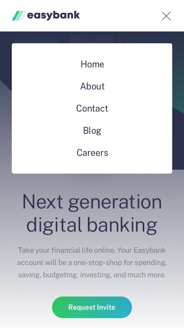

# easybank-landing-page

# Front-end Style Guide

## Layout

## Design screenshots 

# Active states

# Desktop design

# Desktop-preview

# Mobile design

# Mobile-nav-design

The designs were created to the following widths:

- Mobile: 375px
- Desktop: 1440px

## Colors

### Primary

- Dark Blue: hsl(233, 26%, 24%)
- Lime Green: hsl(136, 65%, 51%)
- Bright Cyan: hsl(192, 70%, 51%)

### Neutral

- Grayish Blue: hsl(233, 8%, 62%)
- Light Grayish Blue: hsl(220, 16%, 96%)
- Very Light Gray: hsl(0, 0%, 98%)
- White: hsl(0, 0%, 100%)

## Typography

### Body Copy

- Font size: 18px

### Font

- Family: [Public Sans](https://fonts.google.com/specimen/Public+Sans)
- Weights: 300, 400, 700
